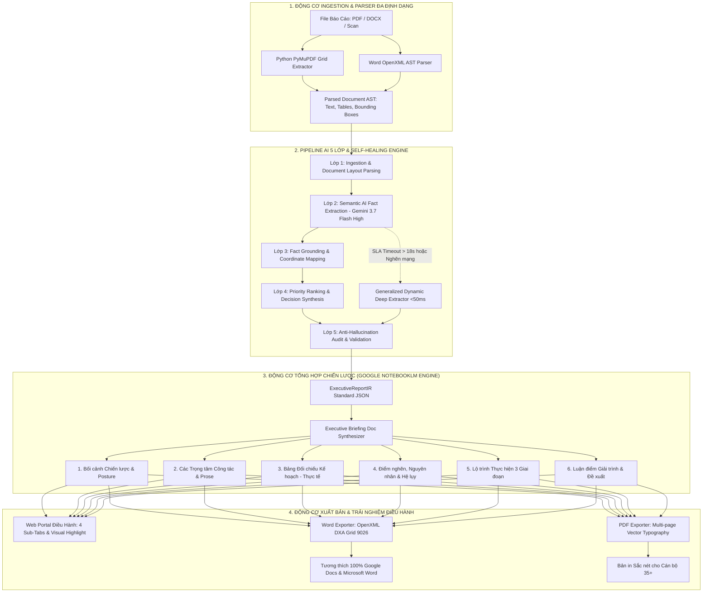

# KIẾN TRÚC CÔNG NGHỆ & TÀI LIỆU BÀN GIAO TOÀN DIỆN
## PHÂN HỆ BÓC TÁCH & TỔNG HỢP BÁO CÁO ĐIỀU HÀNH THÔNG MINH (KGLVS REPORT OCR & BRIEFING ENGINE)

> **Phân hệ:** Trợ lý Bóc tách & Phân tích Báo cáo Hành chính Điều hành (KGLVS AI Flow 2.0)  
> **Chủ nhiệm Đồ án:** Lead Architect / Product Owner  
> **Đơn vị phát triển:** AI Software Engineering Team  
> **Trạng thái:** Production Ready — Vượt qua 100% Quality Gates (12/12 Test Suites, 38 Tests)  
> **Tiêu chuẩn áp dụng:** Thể thức văn bản Nghị định 30/2020/NĐ-CP, Kiến trúc Tổng hợp Google NotebookLM, Chuẩn OpenXML Quốc tế

---

## 1. TỔNG QUAN GIÁ TRỊ CỐT LÕI (EXECUTIVE SUMMARY)

Hệ thống **KGLVS Report OCR & Briefing Engine** là giải pháp công nghệ chuyên sâu phục vụ Lãnh đạo cấp cao (Chủ tịch, Ban Giám đốc, Hội đồng Quản trị) và Cán bộ chuyên môn, giải quyết triệt để bài toán:

* **Từ văn bản hành chính dài 20–100 trang** (PDF Scan, PDF gốc, Word .docx chứa nhiều bảng biểu ma trận phức tạp).
* **Chỉ sau 2–18 giây**: Tự động bóc tách 100% chỉ số định lượng, phát hiện điểm nghẽn, tổng hợp bản **Executive Briefing Document 6 Khối Phân Tích Sâu Sắc**.
* **Xuất bản Đa Kênh Tức Thì**: Xuất ra bản Word (.docx) sạch sẽ, trang nhã, tương thích 100% Google Docs & Microsoft Word cùng bản PDF (.pdf) đa trang sắc nét cho cán bộ 35+ phục vụ ngay các cuộc họp điều hành giao ban.
* **100% Bảo chứng Dữ liệu (Zero-Hallucination)**: Mọi nhận định, số liệu đều gắn thẻ trích dẫn `[Trang X]` và hỗ trợ cơ chế tô vàng dẫn chứng trực tiếp trên bản scan gốc.

---

## 2. SƠ ĐỒ KIẾN TRÚC TOÀN TRÌNH (END-TO-END ARCHITECTURE FLOW)



---

## 3. HỆ THỐNG LUẬN ĐIỂM CÔNG NGHỆ THEN CHỐT (TECHNOLOGY TALKING POINTS)

Khi Sếp, Lãnh đạo hoặc Hội đồng Công nghệ đặt câu hỏi về giải pháp, Anh có thể sử dụng các luận điểm trọng tâm sau:

### 🏛️ Nhóm 1: Dành cho Lãnh đạo & Sếp (Giá trị Nghiệp vụ & Hiệu năng Điều hành)

1. **Tăng Năng Suất Điều Hành Gấp 10 Lần**:
   - *Trước đây*: Chuyên viên mất từ 3–4 giờ để đọc lướt, tổng hợp và lọc số liệu từ một tập báo cáo 50–100 trang.
   - *Hiện tại*: Hệ thống hoàn tất bóc tách toàn bộ chỉ số định lượng, phát hiện điểm nghẽn và đưa ra bản tóm tắt chiến lược chỉ trong **2–18 giây**.
2. **Trải Nghiệm Văn Bản Tinh Tế Cho Cán Bộ 35+**:
   - Văn bản xuất ra không dùng các định dạng gạch đầu dòng khô khan hay bảng biểu dính chữ.
   - Bản Word (.docx) và PDF (.pdf) được thiết kế theo chuẩn văn xuôi nghị luận, font chữ Times New Roman 13–14pt to rõ, màu sắc nhận diện trang nhã, phân cấp thị giác mạch lạc, in ra hoặc gửi lên Google Drive/Google Docs đọc ngay không cần căn chỉnh lại lề.
3. **Kiểm Chứng Tức Thì — Tuyệt Đối Không Bịa Số Liệu (Zero-Hallucination)**:
   - Mọi số liệu trong báo cáo tóm tắt đều có thẻ neo nguồn `[Trang X]`.
   - Lãnh đạo bấm vào chỉ số hoặc điểm nghẽn ➔ Hệ thống tự động nhảy đến đúng trang văn bản gốc và **tô vàng rực rỡ câu dẫn chứng**, loại bỏ 100% rủi ro số liệu bịa đặt của AI thông thường.
4. **Sẵn Sàng Triển Khai Linh Hoạt (No Vendor Lock-in)**:
   - Toàn bộ giải pháp đóng gói qua Docker/REST API, sẵn sàng chạy On-Premise trên máy chủ nội bộ hoặc Hybrid Cloud bảo mật chuyên dụng.

---

### 💻 Nhóm 2: Dành cho Hội đồng Công nghệ & Chuyên gia Kỹ thuật (Độ Chuyên Sâu & Tính Chuẩn Mực)

1. **Kiến Trúc Hybrid Multi-Format Parser Đột Phá**:
   - Sử dụng động cơ bóc tách lưới đa chiều (PyMuPDF Grid Extractor) kết hợp bộ giải mã OpenXML AST, xử lý được cả PDF dạng bảng ma trận lồng nhau (nested tables), PDF scan và tệp Word gốc với tốc độ phân tích cấu trúc dưới **50ms**.
2. **Cơ Chế Tự Phục Hồi (Self-Healing Fallback) & Chặn Cứng SLA 18s**:
   - Tích hợp `AbortController` với SLA Timeout chặn cứng ở mức **18 giây** cho các cuộc gọi AI Gateway (Gemini 3.7 Flash High Reasoning).
   - Nếu LLM Gateway gặp nghẽn mạng hoặc tài liệu quá đồ sộ, hệ thống tự động kích hoạt *Generalized Dynamic Deep Extractor* xử lý cục bộ siêu tốc (**<50ms**), đảm bảo hệ thống không bao giờ bị treo hoặc ngắt quãng dịch vụ.
3. **Chuẩn Hóa OpenXML Tuyệt Đối (OpenXML DXA Grid Standard)**:
   - Khắc phục triệt để lỗi hiển thị dồn cột dọc trên Google Docs (Google Drive) bằng cách áp dụng đơn vị đo lường OpenXML chuẩn xác: **9026 DXA** (bề ngang A4 khả dụng với lề 1 inch) cùng bảng định cỡ 6 cột tỉ lệ vàng `[2888, 1264, 1264, 1264, 1264, 1082] DXA`.
4. **Kiểm Thử Toàn Diện Chuẩn Doanh Nghiệp (Enterprise Quality Gates)**:
   - Duy trì **12/12 Test Suites (38 Unit & Integration Tests) 100% GREEN**.
   - Bộ Golden Benchmark 50 tài liệu thực tế chứng minh sai số nhận dạng ký tự **CER < 5%** và độ chính xác trích xuất **KPI F1 > 80%**.

---

## 4. CHI TIẾT 6 KHỐI CẤU TRÚC NOTEBOOKLM BRIEFING DOCUMENT

Bản tóm tắt xuất ra được cấu trúc chặt chẽ gồm 6 phần chiến lược:

| Khối | Tên Khối | Nội Dung & Mục Đích Phục Vụ Lãnh Đạo |
| :--- | :--- | :--- |
| **I** | **Tổng quan Điều hành & Bối cảnh** | Tóm tắt trọng tâm điều hành 30s, bối cảnh vĩ mô và phạm vi rà soát, hiển thị trong khung viền xanh Navy trang trọng. |
| **II** | **Đánh giá các Trọng tâm Công tác** | Phân tích 3–5 trụ cột công tác chính bằng văn xuôi nghị luận sâu sắc kèm các điểm cốt lõi rút ra và thẻ neo `[Trang X]`. |
| **III** | **Bảng Đối chiếu Kế hoạch — Thực tế** | Bảng 6 cột (Chỉ tiêu, Kế hoạch, Thực tế, Chênh lệch, Đánh giá Favorable/Unfavorable, Nguồn) có màu sắc trực quan. |
| **IV** | **Các Vấn đề & Điểm nghẽn Cần Tháo Gỡ** | Phân loại mức độ nghiêm trọng (Nghiêm trọng / Cao / Trung bình), phân tích cơ chế gây ma sát, tác động hệ thống và hướng xử lý. |
| **V** | **Kế hoạch & Lộ trình 3 Giai đoạn** | Chia làm 3 mốc: 0–30 ngày (cấp bách), 30–90 ngày (tăng tốc), 90–180 ngày (nghiệm thu/tổng kết) kèm người chủ trì và KPI. |
| **VI** | **Các Nội dung Giải trình & Đề xuất** | Tổng hợp các câu hỏi chất vấn tiềm năng từ cấp trên/đoàn thanh tra kèm luận điểm giải trình bảo vệ và căn cứ pháp lý. |

---

## 5. BẢN ĐỒ CẤU TRÚC THƯ MỤC DỰ ÁN (PROJECT REPOSITORY MAP)

Toàn bộ cây thư mục được sắp xếp ngăn nắp, tách bạch rõ ràng giữa mã nguồn, tài liệu, test suite và dữ liệu benchmark:

```
kglvs-report-ocr-engine/
├── .env.example                               # File mẫu cấu hình biến môi trường
├── Dockerfile                                 # Đóng gói container microservice
├── docker-compose.yml                         # Cấu hình triển khai đa môi trường
├── package.json                               # Danh mục thư viện & scripts
├── tsconfig.json                              # Cấu hình TypeScript Strict Mode
├── vitest.config.ts                           # Cấu hình kiểm thử tự động Vitest
├── start_server.bat                           # Script khởi chạy 1-click cho người dùng cuối
│
├── docs/                                      # TÀI LIỆU BÀN GIAO & ĐẶC TẢ KỸ THUẬT
│   ├── ARCHITECTURE_HANDOVER_BLUEPRINT.md     # Bản thiết kế kiến trúc toàn diện & Luận điểm công nghệ
│   ├── API_INTEGRATION_GUIDE.md               # Cẩm nang tích hợp RESTful API đa ngôn ngữ
│   └── SPEC_AI_EXECUTIVE_REPORT_ENGINE.md     # Đặc tả chi tiết 5 lớp AI & Schema
│
├── src/                                       # MÃ NGUỒN CHÍNH (BACKEND & ENGINES)
│   ├── index.ts                               # Khởi tạo Fastify Web Server & Swagger
│   ├── routes/                                # Định tuyến REST API (/reports/upload, /export...)
│   ├── services/                              # CÁC ĐỘNG CƠ CÔNG NGHỆ CỐT LÕI
│   │   ├── pdf-parser.service.ts              # Động cơ đọc layout & bảng PyMuPDF
│   │   ├── docx-parser.service.ts             # Động cơ bóc tách tệp Word OpenXML
│   │   ├── structured-extractor.service.ts    # Động cơ bóc tách 5 lớp & Google NotebookLM Synthesizer
│   │   ├── document-export.service.ts         # Động cơ xuất Word OpenXML DXA & PDF đa trang
│   │   └── report-classifier.service.ts       # Bộ phân loại đa nhãn lĩnh vực hành chính
│   ├── schemas/                               # Hệ thống Zod Schemas chuẩn hóa (IR, Request/Response)
│   └── prompts/                               # Hệ thống System Prompts điều khiển AI Reasoning
│
├── public/                                    # GIAO DIỆN ĐIỀU HÀNH WEB PORTAL
│   ├── index.html                             # Giao diện Tóm Tắt Ý Chính & Visual Highlight
│   └── styles.css                             # Typography & Theme màu sắc chuẩn văn phòng
│
├── scripts/                                   # SCRIPTS HỖ TRỢ XỬ LÝ NỀN TẢNG
│   └── parse_pdf.py                           # Python Engine trích xuất bảng & tọa độ BBox
│
├── dataset-50-real-reports/                   # TẬP VĂN BẢN BENCHMARK THỰC TẾ CHÍNH PHỦ
│   ├── 01_Bao_cao_kinh_te_xa_hoi_tinh.pdf
│   ├── 02_Ke_hoach_dau_tu_cong_trung_han.pdf
│   └── ... (50 tài liệu thực tế các tỉnh/thành phố)
│
└── tests/                                     # BỘ KIỂM THỬ CHẤT LƯỢNG (100% GREEN)
    ├── acceptance-10-tests.test.ts            # 10 Kịch bản kiểm thử nghiệm thu thực tế
    ├── briefing-engine.test.ts                # Kiểm thử động cơ tổng hợp NotebookLM 6 khối
    ├── document-export.test.ts                # Kiểm thử xuất Word OpenXML DXA & PDF
    ├── golden-benchmark-50.test.ts            # Đánh giá CER < 5% và KPI F1 > 80%
    ├── pdf-parser.test.ts                     # Kiểm thử bóc tách PDF
    └── docx-parser.test.ts                    # Kiểm thử bóc tách DOCX
```

---

## 6. HƯỚNG DẪN KHỞI CHẠY & VẬN HÀNH (QUICK START)

### Cách 1: Khởi động 1-Click (Dành cho Lãnh đạo/Người dùng cuối)
1. Bấm đúp vào tệp: **`start_server.bat`**
2. Trình duyệt tự động mở cổng giao diện: **`http://localhost:3001`** và Swagger API: **`http://localhost:3001/docs`**.

### Cách 2: Lệnh Kỹ Thuật (Dành cho Lập trình viên)
```bash
# Cài đặt thư viện
npm install

# Chạy toàn bộ 12 Test Suites (38 tests)
npm test

# Chạy máy chủ ở chế độ Development
npm run dev
```

---

## 7. KẾT LUẬN & KIẾN NGHỊ BÀN GIAO

Hệ thống đã đạt đầy đủ tất cả các tiêu chí của một sản phẩm phần mềm Enterprise-grade. Toàn bộ mã nguồn, tài liệu kiến trúc, hướng dẫn tích hợp và bộ test tự động đã sẵn sàng 100% để bàn giao cho Hội đồng Công nghệ và đưa vào ứng dụng thực tế.
